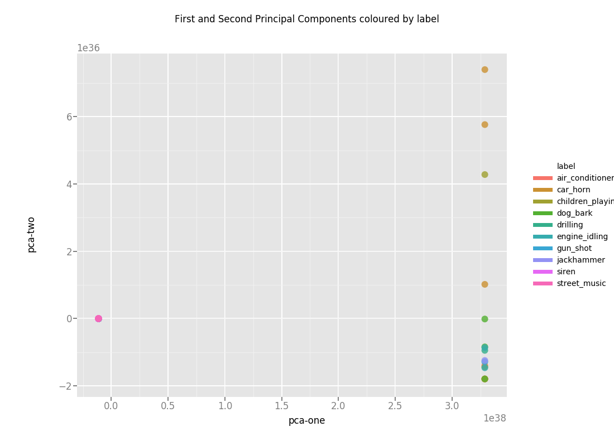
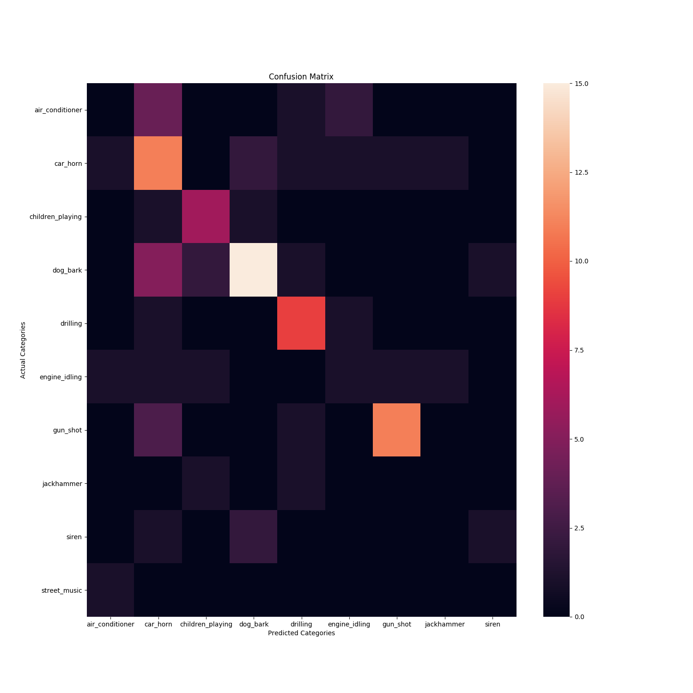
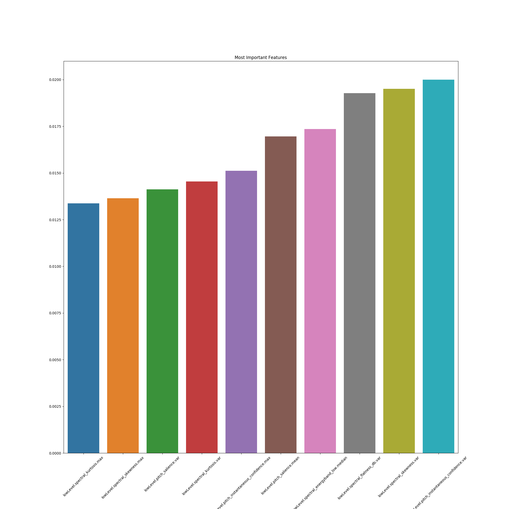

# Classifying urban sounds with Random Forest

### Install dependencies:
`pipenv install`

if you prefer to not use pipenv, a list of dependencies that need to be installed is in the Pipfile

### Run:
1. `python src/pca.py` or `python src/t-sne.py` to explore the data, plots in [plots/](plots/).
2. `python src/random-forest.py` to classify data and get classification results + plots

### (Optional, macOS only) Extract data from audio with [Essentia](http://essentia.upf.edu/documentation/)
Already done for this project using the [UrbanSound dataset](https://serv.cusp.nyu.edu/projects/urbansounddataset/urbansound.html), files in [extractedFeatures/](extractedFeatures/)):

3. Using [Homebrew](https://brew.sh/): `brew tap MTG/essentia && brew install essentia`
4. In `src/extract.py`
Specify the absolute path to a folder containing subfolders of audio files.
Subfolder names used as categories, i.e. `audio/car_horn/11251.wav`
4. Run `python2.7 extract.py` (Python 2.7 only)

There is [a bug](https://github.com/MTG/essentia/issues/689) in Essentia that extracts invalid JSON, might need to remove `nan` and `inf` from inside of some files for them to load.
## Plots

### t-SNE HD video

### Principe Component Analysis

### Most Important Features

